# Open Deep Research - Application Flow Diagram

## Complete Application Flow and Logic

```mermaid
graph TD
    %% User Entry Points
    A[User visits Landing Page] --> B{User Signed In?}
    B -->|No| C[Show Sign In Button]
    B -->|Yes| D[Show Chat Input]
    
    %% Initial Research Creation
    D --> E[User enters research topic]
    E --> F[createResearchAndRedirect]
    F --> G[Create research record in DB]
    G --> H[Redirect to /chat/chatId]
    
    %% Chat Page Flow
    H --> I[Load Chat Page]
    I --> J{Questions exist?}
    J -->|No| K[Generate questions with LLM]
    K --> L[Save questions to DB]
    L --> M[Show Questions Page]
    J -->|Yes| M
    
    %% Questions Phase
    M --> N{User answers questions?}
    N -->|Skip| O[Store empty answers array]
    N -->|Answer| P[Store user answers]
    O --> Q[Call startResearch]
    P --> Q
    
    %% Research Workflow Initiation
    Q --> R[Check user limits]
    R --> S{Limits OK?}
    S -->|No| T[Throw error - No remaining researches]
    S -->|Yes| U[Build research topic from initial message + Q&A]
    U --> V[Update DB with research topic & start time]
    V --> W[Trigger Start Research Workflow]
    W --> X[Schedule 15min timeout cancellation]
    
    %% Start Research Workflow
    X --> Y[Start Research Workflow]
    Y --> Z[Generate Initial Plan]
    Z --> AA[LLM generates research queries]
    AA --> AB[Parse queries with JSON model]
    AB --> AC[Generate plan summary]
    AC --> AD[Store initial state in Redis]
    AD --> AE[Emit planning_completed event]
    
    %% Gather Search Workflow
    AE --> AF[Invoke Gather Search Workflow]
    AF --> AG[Iterative Search Process]
    
    %% Search Iteration Loop
    AG --> AH[Search Iteration Start]
    AH --> AI[Perform web search for each query]
    AI --> AJ[Scrape search results]
    AJ --> AK[Summarize content with LLM]
    AK --> AL[Store search results]
    AL --> AM{Budget remaining?}
    AM -->|Yes| AN[Evaluate if more search needed]
    AN --> AO{Need more search?}
    AO -->|Yes| AP[Generate new queries with LLM]
    AP --> AH
    AO -->|No| AQ[Complete search phase]
    AM -->|No| AQ
    
    %% Parallel Report Generation
    AQ --> AR[Start Parallel Tasks]
    AR --> AS[Generate Cover Image]
    AR --> AT[Generate Final Report]
    
    %% Cover Image Generation
    AS --> AU[Generate image prompt with LLM]
    AU --> AV[Create image with FLUX model]
    AV --> AW[Upload to S3]
    AW --> AX[Return image URL]
    
    %% Report Generation
    AT --> AY[Read final search results from Redis]
    AY --> AZ[Stream report generation with LLM]
    AZ --> BA[Emit progressive report updates]
    BA --> BB[Complete report generation]
    
    %% Completion
    AX --> BC[Wait for both tasks]
    BB --> BC
    BC --> BD[Extract markdown headings]
    BD --> BE[Update DB with final report]
    BE --> BF[Set status to completed]
    BF --> BG[Emit research_completed event]
    
    %% UI State Management
    BG --> BH[Frontend polls /api/research]
    BH --> BI{Research status?}
    BI -->|questions| BJ[Show Questions Page]
    BI -->|processing| BK[Show Report Loading Page]
    BI -->|completed| BL[Show Final Report Page]
    
    %% Real-time Updates
    BK --> BM[Poll for events every few seconds]
    BM --> BN[Display timeline progress]
    BN --> BO[Show search results as they come]
    BO --> BP[Show partial report updates]
    BP --> BQ{Research complete?}
    BQ -->|No| BM
    BQ -->|Yes| BL
    
    %% Final Report Display
    BL --> BR[Display markdown report]
    BR --> BS[Show table of contents]
    BS --> BT[Display citations]
    BT --> BU[Show cover image]
    BU --> BV[Enable PDF download]
    
    %% Error Handling
    T --> BW[Show error message]
    AH --> BX{Search errors?}
    BX -->|Yes| BY[Try alternative scraping]
    BY --> BZ{Fallback successful?}
    BZ -->|No| CA[Log error, continue with available results]
    BZ -->|Yes| AK
    
    %% Cancellation Flow
    X --> CB[15min timeout scheduled]
    CB --> CC{Workflow still running?}
    CC -->|Yes| CD[Cancel workflow via /api/cancel]
    CD --> CE[Update status to cancelled]
    
    %% Database Schema States
    subgraph "Database States"
        DF[status: questions]
        DG[status: pending] 
        DH[status: processing]
        DI[status: completed]
        DF --> DG --> DH --> DI
    end
    
    %% External Services
    subgraph "External Services"
        EA[Together AI - LLM Models]
        EB[Firecrawl - Web Scraping]
        EC[Jina AI - Fallback Scraping]
        ED[FLUX - Image Generation]
        EE[AWS S3 - Image Storage]
        EF[QStash - Workflow Orchestration]
        EG[Redis - State & Event Storage]
        EH[PostgreSQL - Research Data]
    end
    
    %% Service Connections
    AA -.-> EA
    AB -.-> EA
    AC -.-> EA
    AK -.-> EA
    AZ -.-> EA
    AJ -.-> EB
    BY -.-> EC
    AV -.-> ED
    AW -.-> EE
    W -.-> EF
    AD -.-> EG
    AL -.-> EG
    AE -.-> EG
    G -.-> EH
    BE -.-> EH
    
    %% Styling
    classDef userAction fill:#e1f5fe
    classDef workflow fill:#f3e5f5
    classDef database fill:#e8f5e8
    classDef external fill:#fff3e0
    classDef error fill:#ffebee
    
    class A,E,N userAction
    class Y,AF,AG workflow
    class G,BE,BF database
    class EA,EB,EC,ED,EE,EF,EG,EH external
    class T,BW,CA error
```

## Key Components and Data Flow

### 1. User Interface Flow
- **Landing Page** → **Chat Input** → **Questions Page** → **Loading Page** → **Final Report**
- Real-time polling for status updates during research process
- Progressive display of search results and report generation

### 2. Backend Workflow Architecture
- **Start Research Workflow**: Orchestrates the entire research process
- **Gather Search Workflow**: Handles iterative web searching and content processing
- **Parallel Processing**: Cover image generation and report writing happen simultaneously

### 3. Data Storage Strategy
- **PostgreSQL**: Persistent research data, user information, final reports
- **Redis**: Temporary workflow state, real-time events, search results
- **S3**: Generated cover images and assets

### 4. AI/LLM Integration Points
- Question generation from user input
- Research planning and query generation
- Content summarization from web scraping
- Final report generation
- Cover image prompt creation

### 5. External Service Dependencies
- **Together AI**: Multiple LLM models for different tasks
- **Firecrawl/Jina**: Web scraping with fallback options
- **FLUX**: AI image generation
- **QStash**: Workflow orchestration and scheduling

### 6. Error Handling & Resilience
- Automatic fallback between scraping services
- Budget-limited iterations to prevent infinite loops
- 15-minute timeout protection
- Graceful degradation when services fail